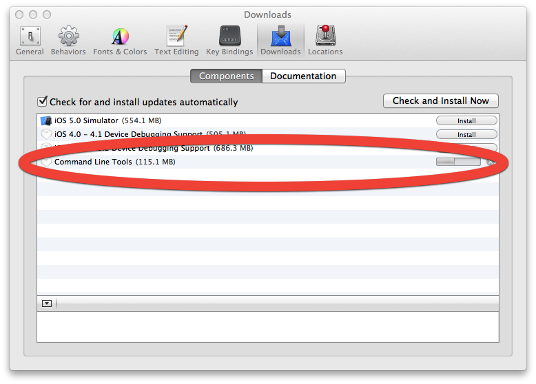

OSX New Box (Mac Mini media center)
===========

 
-----------
Main shell script is currently used as a guideline document and could generate errors.

Having the called install scripts functioning as intended is the current focus point.  

<hr>
Git functionality is by default not installed on OS X. This functionality can be added by installing the command line tools via:
  * Install [Xcode](http://itunes.apple.com/nl/app/xcode/id497799835?mt=12)
  * And enable the command line Tools from within Xcode
    * Preferences, Downloads, Command Line Tools
    
  * Next, open terminal and type:
    ```bash

    mkdir ~/Github
    cd ~/Github
    git clone https://github.com/ajongsma/OSX_NewBox.git
    ```

Things to consider:
---
Get the [NewzNAB Premium](http://www.newznab.com/download.html) edition by donating a payment of 12GBP (approx 20USD). This will incorporate many additional features including:
* Thumbnailing from available archive types
* Memcache/apc support
* Full rar archive file listings
* Mediainfo integration
* CMS type role limits
* Sphinx MySql search support
* Etc.

Get the [OS X Server v2.0](http://itunes.apple.com/us/app/os-x-server/id537441259?mt=12). This will incorporate many additional and enhanced features including:
* Server App
* Virtual Private Network
* Mail Services
* Time Machine
* File Sharing
* Etc.

Get the [Plex Mobile for IOS](http://www.plexapp.com/ios.php) to gain instant access to the entire media library wherever you are.
* A Mobile Media Center in your Hand
* A Remote

Get a free account on  [Trakt.TV](http://http://trakt.tv). This makes it possible to:
* Keep track of movie and tv series progress a scrobble mechanism.
* Mark movies within Trakt.TV which are automatically downloaded by CouchPotato
* Etc.

Get a free account on [MyPlex](http://my.plexapp.com). This makes it possible to:
* Publish your Plex Media Server for Personal Use
* Share your private Sections with your Friends
* Bookmark Videos for Later
* Automatic Configuration
* Etc.

<hr>

# SETUP
* OS X Mountain Lion
  * Updated GNU core utilities (coreutils)
  * apple-gcc42
  * gnu-sed
  * autoconf
  * automake
  * findutils
  * bash
  * wget
  * texi2html
  * yasm
  * x264
  * faac
  * lame
  * xvid
  * ffmpeg
  * mediainfo
* [Xcode](http://itunes.apple.com/us/app/xcode/id497799835?mt=12)
* [Xcode Command Line Tools] (https://developer.apple.com/)
* [Xquartz] (http://xquartz.macosforge.org/landing)
* [OSX Server 2.0](https://itunes.apple.com/nl/app/os-x-server/id537441259?mt=12)
  * Apache
  * PHP 5.3
* [Sublime Text 2](http://www.sublimetext.com)
* [iTerm 2](http://http://www.iterm2.com)
  * [Solarized for iTerm 2] (https://github.com/altercation/solarized/tree/master/iterm2-colors-solarized)
* [Xlog](https://itunes.apple.com/us/app/xlog/id430304898?mt=12&ls=1)
* [Tmux](http://tmux.sourceforge.net/)
  ~ ([Tmux crashcourse] (http://robots.thoughtbot.com/post/2641409235/a-tmux-crash-course))
* [Github for Mac](http://mac.github.com)
* [Dropbox] (http://www.dropbox.com/download?plat=mac)
* Powerline
  * [Powerline Shell] (https://github.com/milkbikis/powerline-shell)
  * [Powerline Tmux] (https://github.com/erikw/tmux-powerline)
* PHP 5.4
* Python
* Pear
* MySQL
  * [MySQL Workbench] (http://dev.mysql.com/downloads/workbench)
* PostgreSQL
  * [pgadmin] (http://www.pgadmin.org/download/macosx.php)
  * [InductionApp] (http://inductionapp.com)
* [HomeBrew] (http://mxcl.github.com/homebrew/)
* [NewzNAB] (http://www.newznab.com/) ``` [NewzNAB Forum] (http://http://www.newznabforums.com) ```
  * [jonnyboy/newznab-tmux] (https://github.com/jonnyboy/newznab-tmux)
  * [Newzdash (NewzNab dashboard)] (https://github.com/tssgery/newzdash)
* [Sphinx] (http://www.sphinxsearch.com/downloads.html)
* [SpotWeb] (https://github.com/spotweb/spotweb/wiki)
* [SabNZBD] (http://sabnzbd.org/)
  * [nzbToMedia] (https://github.com/clinton-hall/nzbToMedia)
* [Cheetah] (http://www.cheetahtemplate.org/download)
* [SickBeard] (http://sickbeard.com/)
  * NewzNAB as a Newznab Provider
  * Spotweb as a Newznab Provider
  * [TraktTV integration] (https://trakt.tv/)
* [Auto-Sub] (http://code.google.com/p/auto-sub/)
* [Couch Potato] (https://couchpota.to/)
  * NewzNAB as a Newznab Provider
  * Spotweb als Newznab Provider
  * [TraktTV integration] (https://trakt.tv/)
* [Periscope] (http://code.google.com/p/periscope/)
* [Headphones] (https://github.com/rembo10/headphones)
  * NewzNAB as a Newznab Provider
  * Spotweb als Newznab Provider
* [Maraschino] (http://www.maraschinoproject.com/)
  ``` [Maraschino Forum] (http://forums.maraschinoproject.com) ```
* [Plex] (http://www.plexapp.com/)
  * [Plex Media Server] (http://plex.r.worldssl.net/PlexMediaServer/0.9.7.12.407-db37d6d/PlexMediaServer-0.9.7.12.407-db37d6d-OSX.dmg)
  * [Plex Media Center Client] (http://www.plexapp.com/download/plex-media-center.php)
  * [Plex Trakt.TV Scrobbler] (https://github.com/tester22/Plex-Trakt-Scrobbler) ([Trakt.TV] (https://trakt.tv/))
  * [Plex Mobile] (http://www.plexapp.com/ios.php)
  * Additional Plex themes
     * [Aeon] (https://github.com/maverick214/PlexAeon)
     * [Blur] (https://github.com/jaaps/skin.blur)
     * [Carbon] (https://github.com/kevinlekiller/Newznab-Carbon-Theme)     
     * [Metropolis] (https://github.com/maverick214/Metropolis)
     * [Quicksilver] (https://github.com/reddragon220/Quicksilver)
     * [Retroplex] (https://github.com/gitSebastian/Retroplex)


# ADDENDUM

* NewzNAB processing: https://github.com/jonnyboy/newznab-tmux
 * tmux 1.6 or newer is needed to runs these scripts. This script relies on tmux reporting that the "Pane is dead". That is how the script knows that is nothing running in that pane and to restart it for another loop. Seeing "Pane is dead" is normal and expected.
 * [jonnyboy - Newznab-tmux](https://github.com/jonnyboy/newznab-tmux)
 * To exit the jonnyboy scripts without any worry of causing problems. Click into the Monitor pane, top left and Ctrl-c, or edit defaults.sh and set running="false". This will stop the monitor script. When all of the other panes show dead, then it is ok to run Ctrl-a c and in new window run killall tmux.
   Take caution that Optimize is not running when you shut down the scripts, Optimize runs in window 2, pane 4.

    ```bash
    cd /User/Newznab/Sites/newznab/update_scripts/nix-scripts/tmux/ && ./start.sh
    ```

# OTHER INFO

* If needed, backup the MySQL database:
 
  ```bash
  mysqldump --opt -u root -p <password> ~/mysql_backup.sql
  ```

<hr>

# TO CHECK OUT
* [Plex theme - Alaska] (http://forums.plexapp.com/index.php/forum/49-alaska/)
* [Plex theme - Refocus] (http://forums.plexapp.com/index.php/forum/65-refocus/)
* [Plex theme - Simplex] (http://forums.plexapp.com/index.php/forum/102-simplex/)

* [Article: The Text Triumvirate] (http://www.drbunsen.org/text-triumvirate.html#tmux)
* [Article: Tmux and Vim, get married] (http://thedrearlight.com/blog/tmux-vim.html)
* Powerline
  * [Powerline - Vim : Readme] (https://github.com/Lokaltog/vim-powerline/blob/develop/doc/Powerline.txt)
  * [Powerline - Vim] (https://github.com/Lokaltog/vim-powerline)
  * [Powerline - oh-my-zsh] (https://github.com/jeremyFreeAgent/oh-my-zsh-powerline-theme)
* [Solarized] (http://ethanschoonover.com/solarized)
  * [HowTo] (http://blog.likewise.org/2012/04/how-to-set-up-solarized-color-scheme.html)
  * [Solarized iTerm 2] (https://github.com/altercation/solarized/tree/master/iterm2-colors-solarized)
* Bash Completion
* Ruby
* [GeekTool] (http://projects.tynsoe.org/en/geektool)
  * http://lifehacker.com/5834676/build-an-attractive-informative-mac-desktop-with-geektool
  * http://mac.appstorm.net/roundups/utilities-roundups/over-46-powerful-geeklets-and-scripts-for-the-geek-within-you/
  * http://mac.tutsplus.com/tutorials/customization/5-ways-to-make-your-macs-desktop-better-with-geektool/
* NewzNAB
  * [NewzNAB - Custom Content Page - Mini NZB Feed Compare] (http://www.newznabforums.com/index.php?topic=623.0)
  * [Baffi-Theme] (https://github.com/Frikish/Baffi-Theme--Newznab-)
  * [Post Processing script: Auto release assembler suite] (http://www.newznabforums.com/index.php?topic=631.msg5625#msg5625)
  * RegEx ``` a.b.teevee ```
  ``` Disable all except: /^(\[|)(?P<name>.*?)(\]|) (\- |)\[(?P<parts>\d{1,3}\/\d{1,3})\] \- \".*?xvid.*?\"/i ```
  ``` Add - Category 1080p WEB-DL (Ordinal 2): /^(RE\: |)\[.*?\](\-\[FULL\]|)\-\[\#.*?\](\-\[FULL\]|)\-\[(?P<name>.*?(1080[a-zA-Z].WEB.DL).*?)\]( |)\-\[(?P<parts>\d{1,3}\/\d{1,3})\]/ ```
  ``` Add - Category 720p WEB-DL (Ordinal 3): /^(RE\: |)\[.*?\](\-\[FULL\]|)\-\[\#.*?\](\-\[FULL\]|)\-\[(?P<name>.*?(720[a-zA-Z].WEB.DL).*?)\]( |)\-\[(?P<parts>\d{1,3}\/\d{1,3})\]/ ```
  ``` Add - Category HD (Ordinal 4): /^(RE\: |)\[.*?\](\-\[FULL\]|)\-\[\#.*?\](\-\[FULL\]|)\-\[(?P<name>.*?(720[a-zA-Z].HDTV.[a-zA-Z]264).*?)\]( |)\-\[(?P<parts>\d{1,3}\/\d{1,3})\]/ ```
  ``` Add - Category SD (Ordinal 5): /^(RE\: |)\[.*?\](\-\[FULL\]|)\-\[\#.*?\](\-\[FULL\]|)\-\[(?P<name>.*?(HDTV.[a-zA-Z]264).*?)\]( |)\-\[(?P<parts>\d{1,3}\/\d{1,3})\]/ ```
  * Blacklist:
  ``` fina|wrestling|nba|mma|Croatian|Spanish|Turkish|TNA|NFL|WWE|EPL|National.Geographic|wtcc|nba|olympics|xxx|german|danish|flemish|dutch|french|swedish|swesub|deutsch|nl\.?sub|norwegian|\.ita\. FR|DE|ITA|sie|seit|ihn|ihm|haben|besitzen|sein|kriegen|nehmen|welche|jenes|von|auf|gegen|nach|das|sein|der|und|fuer|ersten|leicht|meinem|zum|aus|dem|blitzlicht|alle|grosse|zed|ich|sed|blitzen|NCAA Basketball ```
